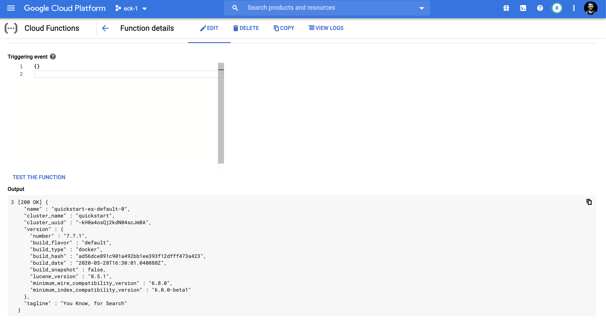

# super-saiyajin
Serverless Search Engine


How hard is it to deploy Elastic Cloud Kubernetes and use it from serverless functions? Well, it took me 1 hr, so it's rather easy :)
Let's start with setting up [minikube](https://minikube.sigs.k8s.io/docs/start/).

## Prepare the environment:

Check the [ECK documentation](https://www.elastic.co/guide/en/cloud-on-k8s/current/k8s-deploy-kibana.html) out.

```
./install_eck.sh
./deploy_es_instance.sh
./deploy_kibana_instance.sh
```

Use `monitor_operator_logs.sh` to monitor logs from the ES K8S operator.

## GKE to the rescue!

If you are anything like me, you see the following error in K8S:

```
pod has unbound immediate PersistentVolumeClaims
```

Well, GKE, here we go again!

## Deploy a function

Based on https://codelabs.developers.google.com/codelabs/cloud-functions-go-http/#5

`go.mod`

```
module github.com/GoogleCloudPlatform/golang-samples/functions/codelabs/gopher

go 1.11

require github.com/elastic/go-elasticsearch/v7 v7.6.0

```

`main.go`

```
// Copyright 2019 Google LLC
//
// Licensed under the Apache License, Version 2.0 (the "License");
// you may not use this file except in compliance with the License.
// You may obtain a copy of the License at
//
//     https://www.apache.org/licenses/LICENSE-2.0
//
// Unless required by applicable law or agreed to in writing, software
// distributed under the License is distributed on an "AS IS" BASIS,
// WITHOUT WARRANTIES OR CONDITIONS OF ANY KIND, either express or implied.
// See the License for the specific language governing permissions and
// limitations under the License.

// The cmd command starts an HTTP server.
package main

import (
	"log"
	"net/http"
	"os"

	"github.com/GoogleCloudPlatform/golang-samples/functions/codelabs/gopher"
)

func main() {
	http.HandleFunc("/", gopher.Gopher)

	port := os.Getenv("PORT")
	if port == "" {
		port = "8080"
	}
	log.Printf("Listening on port %s", port)
	if err := http.ListenAndServe(":"+port, nil); err != nil {
		log.Fatal(err)
	}
}

```

`gopher.go`

```
// Copyright 2019 Google LLC
//
// Licensed under the Apache License, Version 2.0 (the "License");
// you may not use this file except in compliance with the License.
// You may obtain a copy of the License at
//
//     https://www.apache.org/licenses/LICENSE-2.0
//
// Unless required by applicable law or agreed to in writing, software
// distributed under the License is distributed on an "AS IS" BASIS,
// WITHOUT WARRANTIES OR CONDITIONS OF ANY KIND, either express or implied.
// See the License for the specific language governing permissions and
// limitations under the License.

// Package gopher contains an HTTP function that shows a gopher.
package gopher

import (
	"crypto/tls"
	"fmt"
	"github.com/elastic/go-elasticsearch/v7"
	"log"
	"net"
	"net/http"
	"time"
)

// Gopher prints a gopher.
func Gopher(w http.ResponseWriter, r *http.Request) {
    // needed because of the self-signed certs from ES
	config := elasticsearch.Config{Addresses: []string{"https://xyz:9200"}, Username: "elastic", Password: "xyz", Transport: &http.Transport{
		MaxIdleConnsPerHost:   10,
		ResponseHeaderTimeout: time.Second,
		DialContext: (&net.Dialer{
			Timeout:   30 * time.Second,
			KeepAlive: 30 * time.Second,
		}).DialContext,
		TLSClientConfig: &tls.Config{
			InsecureSkipVerify: true,
		}}}

	es, err := elasticsearch.NewClient(config)

	if err != nil {
		log.Fatalf("Error creating the client: %s", err)
	}

	res, err := es.Info()
	if err != nil {
		log.Fatalf("Error getting response: %s", err)
	}

	defer res.Body.Close()

	fmt.Fprintf(w, "%v", res)
}

```

## Connecting Google Functions with GKE

https://medium.com/google-cloud/calling-an-internal-gke-service-from-cloud-functions-2958f9218355

## Calling a function

So let's test if our function can reach Elastic:



## Summary

With just few lines of code we have a 3 node Elasticsearch cluster deployed in Kubernetes. We created a Google Function
which calls Elasticsearch.